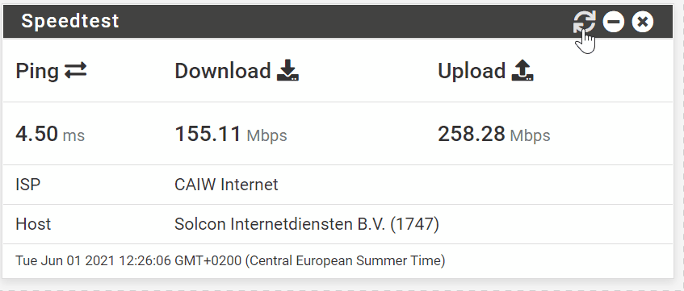
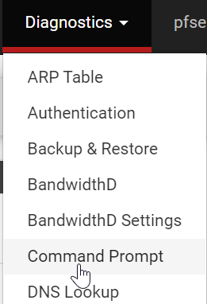
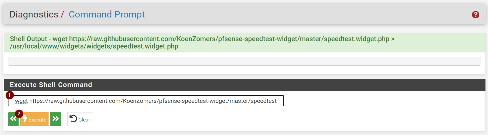
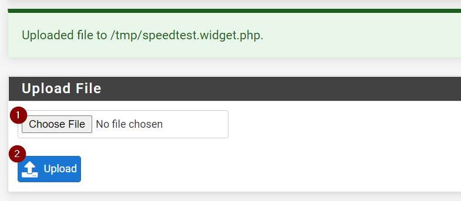
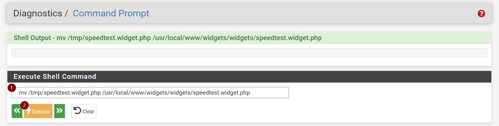
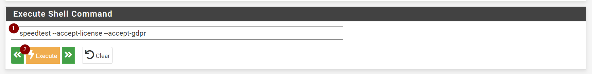
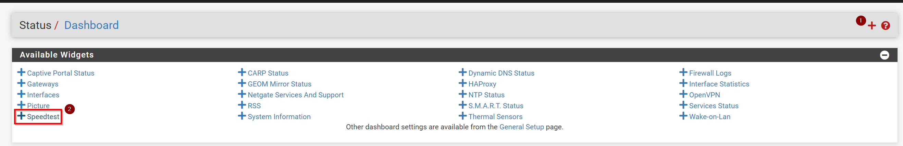
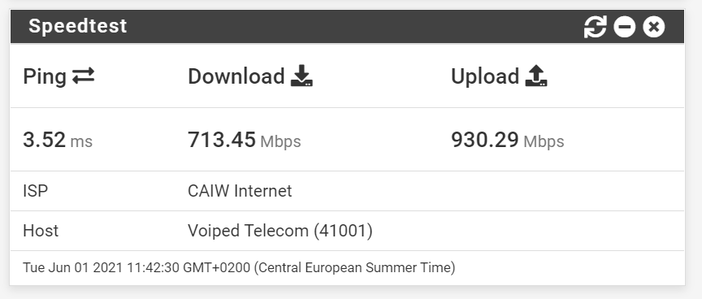
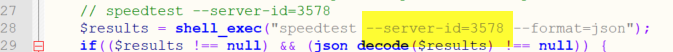
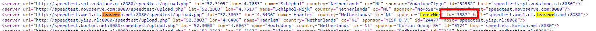

# Speedtest dashboard widget for pfSense



## Install

To use this widget you will need to install the Ookla speedtest CLI package and upload the widget to pfSense. Follow the steps below to do so.

### Adding the Ookla Speedtest CLI package to pfSense
 by following these steps (taken from [here](https://www.speedtest.net/apps/cli)):

```
pkg update && sudo pkg install -g libidn2 ca_root_nss
pkg add "https://install.speedtest.net/app/cli/ookla-speedtest-1.0.0-freebsd.pkg"
```

You have now installed the Ookla CLI onto your pfSense box.

### Adding the Speedtest widget to pfSense

Next step is to add the widget to your pfSense dashboard. For this you'll have two options, which I will both outline below.

#### Option 1: download directly from GitHub using pfSense

For this option, use your browser to go to your pfSense box:

1. In pfSense, go to Diagnostics, command line


1. Download the widget file to the correct location by copy/pasting the following line in the Execute Shell Command box and clicking Execute
```
wget https://raw.githubusercontent.com/KoenZomers/pfsense-speedtest-widget/master/speedtest.widget.php > /usr/local/www/widgets/widgets/speedtest.widget.php
```


#### Option 2: download and upload manually

For this option, right click the link below and save the file to a location on your machine:

1. https://raw.githubusercontent.com/KoenZomers/pfsense-speedtest-widget/master/speedtest.widget.php

1. In pfSense, go to Diagnostics, command line


1. Under Upload File, click on Choose File and select the widget file you have downloaded through the first step

This will upload the widget to the /tmp location

1. Move the file to the correct location by copy/pasting the following line in the Execute Shell Command box and clicking Execute
```
mv /tmp/speedtest.widget.php /usr/local/www/widgets/widgets/speedtest.widget.php
```


### Accept the license and GDPR terms from Ookla's Speedtest CLI

You need to manually and only once accept the license and GDPR terms before the Speedtest CLI will start working. To do so, follow these steps:

1. In pfSense, go to Diagnostics, command line


1. Accept the license and GDPR terms by copy/pasting the following line in the Execute Shell Command box and clicking Execute
```
speedtest --accept-license --accept-gdpr
```



### Adding the Speedtest widget to your pfSense dashboard

One step remains and that is to add the widget to your pfSense dashboard. 

1. Go to the homepage of your pfSense box
2. Click on the red + at the top right
3. Under Available Widgets it should now list a Speedtest widget
 Click on it to add it.
4. At the bottom of the page it should now show the widget. Click on the refresh icon to start pulling data in.


## Specify server

The widget can definitely be made a bit more fancy with a [config menu](https://docs.netgate.com/pfsense/en/latest/development/create-widgets.html#customizing-the-title-and-linking-to-page) to i.e. select a server. For now, that's not present and therefore it will at random test against a server near you. If you wish to target a specific Ookla Speedtest server, you can modify this line in the speedtest.widget.php file. Follow option 2 above to download it, modify it and upload the updated version to your pfSense box.



The server ID you can find by going to the following page and using i.e. CTRL+F to find the server you're looking for. You'll need the ID:

https://c.speedtest.net/speedtest-servers-static.php



For me, targeting a specfic server did not always work well. This has something to do with a flaw in the Ookla Speedtest CLI. It works a bit random.